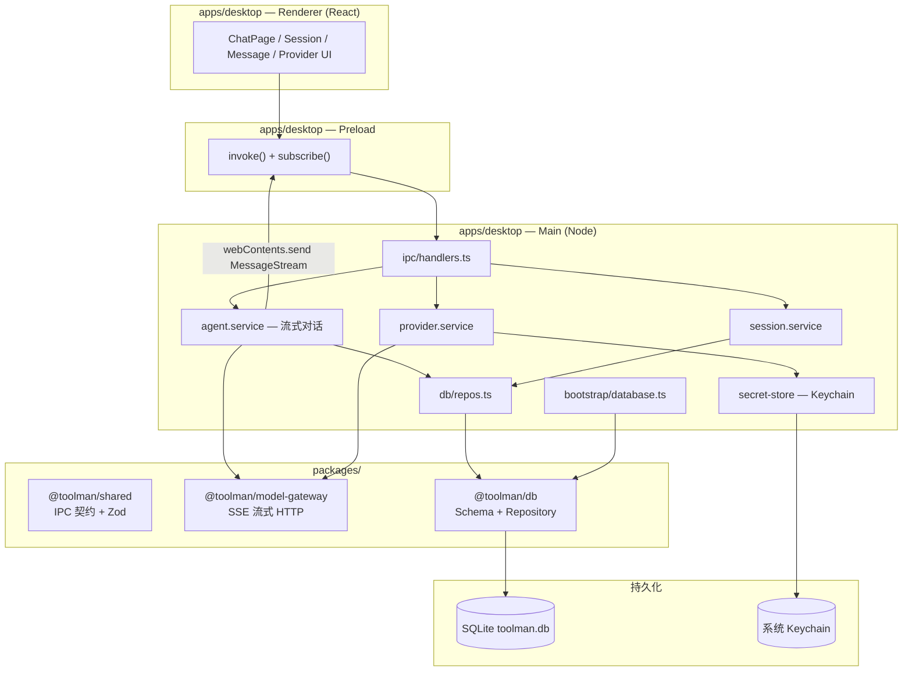

# Toolman

AI 桌面客户端（Cherry Studio 风格），基于 Electron + React + SQLite。当前为 **Beta**（**RC1 内部 dogfood**：`0.2.0-rc.1`，见 [RC1 手册](docs/engineering/RC1_DOGFOOD.md)）：除多 Provider 对话与知识库外，已包含 **P2P 群组同步、社区 Hub、会员与渠道** 等能力；部分模块仍为占位或本地模拟。

## 环境要求

- Node.js ≥ 20
- pnpm 9.x（见 `package.json` → `packageManager`）
- macOS / Windows / Linux
- 可选：[Ollama](https://ollama.com)（本地模型）
- P2P 原生模块：首次 `dev` 会自动执行 `build:p2p`（Rust）

## 快速开始

```bash
# 安装依赖（含 better-sqlite3 的 Electron 重编译）
pnpm install

# 构建全部 workspace 包
pnpm build

# 启动 Desktop（会自动 predev 构建依赖包 + P2P + Community Hub）
pnpm --filter @toolman/desktop dev
```

常用命令：

| 命令 | 说明 |
|------|------|
| `pnpm dev` | Turbo 并行启动各包 watch |
| `pnpm build` | 构建所有包 |
| `pnpm typecheck` | 全仓 TypeScript 检查 |
| `pnpm test` | 单元测试（model-gateway、desktop 等） |
| `pnpm --filter @toolman/desktop test:p2p-integration` | P2P / 多人 workspace 集成测试 |
| `pnpm --filter @toolman/desktop dev:p2p:a` / `dev:p2p:b` | 双实例 P2P 联调（见 `docs/p2p/`） |
| `pnpm db:generate` / `pnpm db:migrate` | Drizzle migration |

## 当前能力边界

### 已实现

**对话与智能体**

- 会话 CRUD、流式对话、多模型并行（最多 4 个）
- Assistant 配置（工具、MCP、技能、知识库、权限）
- 内置工具 + MCP、应用内审批；Anthropic 工具调用
- 思考过程流式（需推理模型）、图片多模态、长期记忆、自主模式/心跳
- IM 渠道：**飞书、Discord** 可用

**知识库**

- 本地/网络知识库、文件/URL/Sitemap 导入、文件夹监听
- 混合检索（向量 + FTS）、RAG、摄取任务、OCR（视觉模型）

**P2P 群组**

- 创建工作区、邀请成员、LAN mDNS + beacon 发现
- 群组文件/笔记/知识库/Agent 配置同步（事件 + mesh catch-up）
- 群组聊天：群主 hub 转发 + 群主离线成员 gossip（见 [docs/p2p/GROUP_CHAT_SLA.md](docs/p2p/GROUP_CHAT_SLA.md)）
- 3～10 人拓扑仿真与 workspace 集成测试：`p2p-multi-member.integration.test.ts`

**社区 Hub（Sidecar）**

- 本地嵌入式社区服务：用户、资源、订单等（开发/演示）
- 与 Desktop 通过 IPC 桥接

**账户与会员**

- 本地身份、用户中心、会员展示与升级流程（**支付为演示/占位**，非生产计费）

**运维（本地优先）**

- 诊断事件写入 `{userData}/diagnostics/events.jsonl`
- 崩溃报告 `{userData}/diagnostics/crashes/*.json`
- 本地更新 manifest：`{userData}/updates/manifest.json`（设置 → 系统诊断可查看）

### 已知限制

| 领域 | 限制 |
|------|------|
| P2P | 无群聊历史补拉；孤立节点不保证送达；WAN 10 人 E2E 未自动化 |
| 群聊 relay | 应用层 gossip，非独立 relay 基础设施；见 GROUP_CHAT_SLA |
| IM | 钉钉/微信/QQ/Slack 配置可保存，运行时为「即将推出」 |
| 会员/支付 | 价格展示与流程为 Beta，无真实支付网关 |
| 语音/会议 | UI 占位 |
| 生产运维 | 无远程 crash 上报、无 CDN 自动更新（仅本地 manifest） |

### 尚未实现 / 规划中

- `@toolman/core` 独立运行时、插件市场
- 完整 E2E UI 自动化、远程更新服务器
- 群聊持久化到 P2P 事件流（离线 catch-up）

## 架构总览



## Monorepo 结构

```
Toolman/
├── apps/
│   └── desktop/          # Electron 应用（唯一前端入口）
│       ├── src/main/     # 主进程：IPC、服务、DB 引导
│       ├── src/preload/  # 预加载：contextBridge API
│       └── src/renderer/ # React UI
├── packages/
│   ├── shared/           # IPC Channel 枚举、Zod Schema、DTO
│   ├── db/               # Drizzle Schema、Migration、Repository
│   ├── knowledge/        # 文档解析、分块、向量、混合检索
│   └── model-gateway/    # LLM Provider HTTP 流式客户端
├── pnpm-workspace.yaml
└── turbo.json
```

## 模块边界

### `apps/desktop`

| 目录 | 职责 | 不应包含 |
|------|------|----------|
| `main/ipc/` | IPC 路由、入参校验入口 | 直接 SQL / HTTP 调用 Provider |
| `main/services/` | 业务编排（会话、消息、Provider） | React / DOM |
| `main/db/repos.ts` | Repository 工厂 | 业务逻辑 |
| `main/mappers/` | DB Row → IPC DTO 转换 | 数据库写入 |
| `main/services/secret-store.ts` | API Key 加解密（Keychain） | Provider 业务 |
| `renderer/features/chat/` | 聊天 UI 与 Hooks | 直接访问 Node / SQLite |
| `preload/` | 暴露 `window.api` | 业务逻辑 |

### `packages/shared`

- **单一事实来源**：IPC 通道名、请求/响应 Zod Schema、`IpcResult` 错误包装
- Renderer 与 Main 均依赖此包（Renderer 通过 Vite alias 引用源码）
- 智能体与知识库相关 IPC 已在 Main 实现；少量遗留通道（如 `MessageGet`、`WorkspaceCreate`）尚未接入

### `packages/db`

- Drizzle Schema（11 表）+ SQL Migration
- `SessionRepository` / `MessageRepository`：会话与消息的 CRUD
- 启动时由 `bootstrap/database.ts` 自动 migrate + seed
- **注意**：`providers` / `assistants` 等仍由 Main service 直接访问（尚无 Repository）

### `packages/model-gateway`

- 纯 HTTP 层，无 Electron / DB 依赖
- `chatStream()`：OpenAI 兼容（含 Ollama）+ Anthropic SSE
- `fetchModels()` / `testConnection()`

## 核心数据流（发送消息）

```
Renderer: MessageSend IPC
  → agent.service.sendMessage()
  → MessageRepository 写入 user + assistant(streaming) 消息
  → ModelGateway.chatStream() 拉取 SSE
  → 每个 chunk：更新 DB + broadcast MessageStream
  → Renderer subscribe 增量渲染
```

## 安全与配置

- **API Key**：通过 Electron `safeStorage` 加密，存入 `providers.api_key_ref`（系统 Keychain），**不**以明文写入 SQLite
- **默认本地模型**：Ollama `http://127.0.0.1:11434/v1`，默认 `gemma4:26b`（启动时自动同步本机模型列表）
- **数据库路径**：`{userData}/toolman.db`（Electron `app.getPath('userData')`）

## 故障排查

### `ERR_PACKAGE_PATH_NOT_EXPORTED` / workspace 包找不到

先构建依赖包：

```bash
pnpm --filter @toolman/desktop^... build
```

### `better-sqlite3` NODE_MODULE_VERSION 不匹配

```bash
pnpm --filter @toolman/desktop exec electron-rebuild -f -w better-sqlite3
```

或重新 `pnpm install`（`postinstall` 会自动 rebuild）。

### `electron.app is undefined`

终端可能设置了 `ELECTRON_RUN_AS_NODE=1`，先执行：

```bash
unset ELECTRON_RUN_AS_NODE
pnpm --filter @toolman/desktop dev
```

### 无法输入 / 发送消息

1. 确认左侧已选中会话
2. 确认模型下拉框有可选模型（Ollama 需运行中：`ollama list`）
3. 查看顶部红色错误条

### P2P 群组消息未送达

1. 设置 → **系统诊断** 查看 P2P 连接与在线 peer 数
2. 确认成员在同一 LAN 或已有 WebRTC 连接（见 [docs/p2p/GROUP_CHAT_SLA.md](docs/p2p/GROUP_CHAT_SLA.md)）
3. 双实例联调：`pnpm --filter @toolman/desktop dev:p2p:a` 与 `dev:p2p:b`

### 诊断与崩溃日志

- 事件日志：`{userData}/diagnostics/events.jsonl`
- 崩溃报告：`{userData}/diagnostics/crashes/`
- 模拟更新：编辑 `{userData}/updates/manifest.json` 中 `latestVersion`

## 工程化

- GitHub Actions CI：`typecheck` + `test` + desktop 集成测试
- P2P Rust 单元测试：`crates/toolman-p2p`
- 群组 SLA 文档：`docs/p2p/GROUP_CHAT_SLA.md`、`docs/p2p/MESH_REPLICATION.md`

## 技术栈

- **Desktop**：Electron 36、electron-vite、React 19
- **DB**：better-sqlite3、Drizzle ORM
- **校验**：Zod（`@toolman/shared`）
- **构建**：pnpm workspace、Turbo
