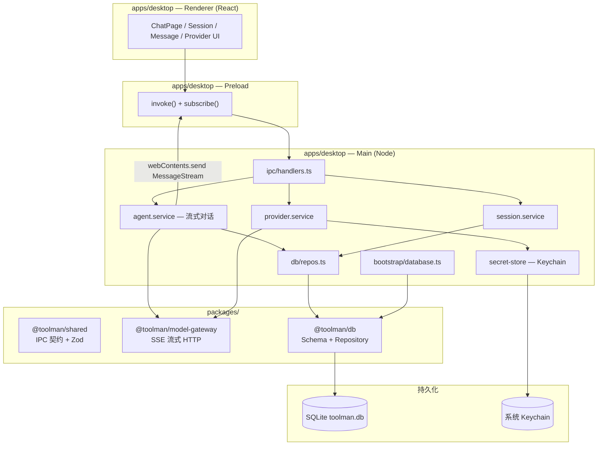

# Toolman

AI 桌面客户端（Cherry Studio 风格），基于 Electron + React + SQLite。当前 MVP 聚焦：**多 Provider 对话、流式输出、会话持久化、本地 Ollama 支持**。

## 环境要求

- Node.js ≥ 20
- pnpm 9.x（见 `package.json` → `packageManager`）
- macOS / Windows / Linux
- 可选：[Ollama](https://ollama.com)（本地模型）

## 快速开始

```bash
# 安装依赖（含 better-sqlite3 的 Electron 重编译）
pnpm install

# 构建全部 workspace 包
pnpm build

# 启动 Desktop（会自动 predev 构建依赖包）
pnpm --filter @toolman/desktop dev
```

常用命令：

| 命令 | 说明 |
|------|------|
| `pnpm dev` | Turbo 并行启动各包 watch（通常直接用 desktop dev 即可） |
| `pnpm build` | 构建所有包 |
| `pnpm typecheck` | 全仓 TypeScript 检查 |
| `pnpm lint` | 同 typecheck（各包 TypeScript 校验） |
| `pnpm test` | 运行单元测试（`@toolman/model-gateway`） |
| `pnpm --filter @toolman/db demo:chat` | 会话/消息 Repository 演示脚本 |
| `pnpm db:generate` | 生成 Drizzle migration |
| `pnpm db:migrate` | 执行 migration（开发时一般由应用启动自动 migrate） |

## 架构总览



## Monorepo 结构

```
Toolman/
├── apps/
│   └── desktop/          # Electron 应用（唯一前端入口）
│       ├── src/main/     # 主进程：IPC、服务、DB 引导
│       ├── src/preload/  # 预加载：contextBridge API
│       └── src/renderer/ # React UI
├── packages/
│   ├── shared/           # IPC Channel 枚举、Zod Schema、DTO
│   ├── db/               # Drizzle Schema、Migration、Repository
│   ├── knowledge/        # 文档解析、分块、向量、混合检索
│   └── model-gateway/    # LLM Provider HTTP 流式客户端
├── pnpm-workspace.yaml
└── turbo.json
```

## 模块边界

### `apps/desktop`

| 目录 | 职责 | 不应包含 |
|------|------|----------|
| `main/ipc/` | IPC 路由、入参校验入口 | 直接 SQL / HTTP 调用 Provider |
| `main/services/` | 业务编排（会话、消息、Provider） | React / DOM |
| `main/db/repos.ts` | Repository 工厂 | 业务逻辑 |
| `main/mappers/` | DB Row → IPC DTO 转换 | 数据库写入 |
| `main/services/secret-store.ts` | API Key 加解密（Keychain） | Provider 业务 |
| `renderer/features/chat/` | 聊天 UI 与 Hooks | 直接访问 Node / SQLite |
| `preload/` | 暴露 `window.api` | 业务逻辑 |

### `packages/shared`

- **单一事实来源**：IPC 通道名、请求/响应 Zod Schema、`IpcResult` 错误包装
- Renderer 与 Main 均依赖此包（Renderer 通过 Vite alias 引用源码）
- 智能体与知识库相关 IPC 已在 Main 实现；少量遗留通道（如 `MessageGet`、`WorkspaceCreate`）尚未接入

### `packages/db`

- Drizzle Schema（11 表）+ SQL Migration
- `SessionRepository` / `MessageRepository`：会话与消息的 CRUD
- 启动时由 `bootstrap/database.ts` 自动 migrate + seed
- **注意**：`providers` / `assistants` 等仍由 Main service 直接访问（尚无 Repository）

### `packages/model-gateway`

- 纯 HTTP 层，无 Electron / DB 依赖
- `chatStream()`：OpenAI 兼容（含 Ollama）+ Anthropic SSE
- `fetchModels()` / `testConnection()`

## 核心数据流（发送消息）

```
Renderer: MessageSend IPC
  → agent.service.sendMessage()
  → MessageRepository 写入 user + assistant(streaming) 消息
  → ModelGateway.chatStream() 拉取 SSE
  → 每个 chunk：更新 DB + broadcast MessageStream
  → Renderer subscribe 增量渲染
```

## 安全与配置

- **API Key**：通过 Electron `safeStorage` 加密，存入 `providers.api_key_ref`（系统 Keychain），**不**以明文写入 SQLite
- **默认本地模型**：Ollama `http://127.0.0.1:11434/v1`，默认 `gemma4:26b`（启动时自动同步本机模型列表）
- **数据库路径**：`{userData}/toolman.db`（Electron `app.getPath('userData')`）

## 故障排查

### `ERR_PACKAGE_PATH_NOT_EXPORTED` / workspace 包找不到

先构建依赖包：

```bash
pnpm --filter @toolman/desktop^... build
```

### `better-sqlite3` NODE_MODULE_VERSION 不匹配

```bash
pnpm --filter @toolman/desktop exec electron-rebuild -f -w better-sqlite3
```

或重新 `pnpm install`（`postinstall` 会自动 rebuild）。

### `electron.app is undefined`

终端可能设置了 `ELECTRON_RUN_AS_NODE=1`，先执行：

```bash
unset ELECTRON_RUN_AS_NODE
pnpm --filter @toolman/desktop dev
```

### 无法输入 / 发送消息

1. 确认左侧已选中会话
2. 确认模型下拉框有可选模型（Ollama 需运行中：`ollama list`）
3. 查看顶部红色错误条

## 当前范围与后续

**已实现（智能体）**

- 会话 CRUD + 流式对话 + 多模型并行（最多 4 个）
- Assistant CRUD + 配置（工具、MCP、技能、知识库、权限等）
- 内置工具 + MCP、工具权限与**应用内审批**（渠道消息同样遵循权限，仅心跳任务全自动）
- 思考过程流式展示（需推理模型，见 [docs/THINKING-STREAM.md](docs/THINKING-STREAM.md)）
- 图片消息（多模态）、长期记忆、自主模式/心跳
- Anthropic Claude **工具调用**（Messages API + tool_use）
- 工具多轮结束后**最终回复流式输出**
- IM 渠道：**飞书、Discord** 可用

**已实现（知识库）**

- 本地/网络知识库 CRUD、文件/URL/Sitemap 导入、文件夹监听
- 混合检索（向量 + FTS）、RAG 注入对话、摄取任务、FTS 重建
- 文件注册表、文件查重
- **OCR 识别**：扫描件 PDF / 图片可在设置中开启，通过视觉模型提取文字后索引（需在知识库设置中配置文档处理 Provider）

**部分实现 / 限制**

- 思考过程：需推理模型；工具中间轮次仍为非流式
- IM：钉钉/微信/QQ/Slack 配置可保存，运行时为「即将推出」
- OCR：依赖已配置的视觉模型；多页 PDF 按页识别，页数过多时可能较慢
- 语音输入、保存到笔记、会议模式：UI 占位

**尚未实现**

- `@toolman/core`、插件、笔记、工作流、群组、社区、P2P 同步
- 自动化规则、语音输入
- 完整 E2E 测试覆盖

**工程化**

- GitHub Actions CI：`typecheck` + `test`
- 各包 `lint` = TypeScript 检查

## 技术栈

- **Desktop**：Electron 36、electron-vite、React 19
- **DB**：better-sqlite3、Drizzle ORM
- **校验**：Zod（`@toolman/shared`）
- **构建**：pnpm workspace、Turbo
