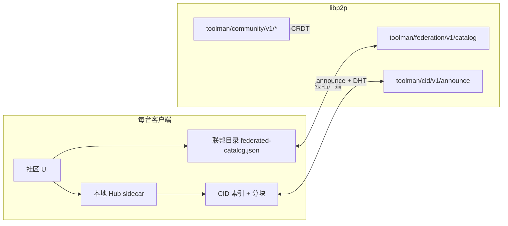

# Community Hub 联邦（F0 / F1）

> **社区版（开源）**：F0 + F1 为必做能力  
> **企业版（闭源）**：F2 官方 / 企业 Hub 为规模化选项

## 目标

在没有企业服务器、不依赖 `https://hub.toolman.app` 的情况下，用户通过 **P2P 联邦** 使用社区全部核心功能：

- 市场发布与浏览（知识库 / MCP / Skills / 工作流）
- 资源包安装（CID + libp2p）
- 留言板 / 评论（Yjs + 签名）

每台客户端仍运行 **本地 Community Hub sidecar**（SQLite 权威存储）；联邦层负责把目录与包同步到已连接的 P2P 邻居。

## 架构



### 数据流（F0 市场）

1. 用户发布资源 → 写入本地 Hub HTTP API
2. Main 进程扫描 `packages/` → 构建 CID manifest → gossipsub announce
3. 同时广播 **联邦目录条目**（`FederatedResourceCatalogEntry`，含 title/author/tags/rootCid）
4. 对端收到后写入 `federated-catalog.json`，UI 合并 Hub 列表 + 联邦列表
5. 安装时通过既有 CID P2P 拉包路径完成

### 合并策略

| 场景 | 行为 |
|------|------|
| 同 `resourceId` 在 Hub 与联邦均存在 | **Hub 优先**（本地 sidecar 或已连接远程 Hub） |
| 同 `resourceId` 在 hub-peer 与 p2p 均存在 | **hub-peer 优先** |
| Hub 不可达 | hub-peer + p2p 联邦目录仍可浏览 |
| 仅 CID announce、无完整 catalog | 降级条目（title = package name） |

## 配置

| 文件 | 路径 | 默认（社区版） |
|------|------|----------------|
| `hub.json` | `{userData}/community/hub.json` | `{ "mode": "local", "federation": { "enabled": true } }` |
| `federation.json` | `{userData}/community/federation.json` | `{ "federationEnabled": true }` |
| `cid.json` | `{userData}/community/cid.json` | `{ "cidDistributionEnabled": true }` |
| `sync.json` | `{userData}/community/sync.json` | `{ "yjsEnabled": true, "requireSignedUpdates": true }` |

环境变量（开发双开仍可用）：

- `TOOLMAN_COMMUNITY_DATA_DIR` — 共用 Hub 数据目录（见 `docs/p2p/DUAL_INSTANCE_DEV.md`）
- `TOOLMAN_COMMUNITY_HUB_URL` — 可选连接远程 Hub（F2 网络版；非 F0 默认）

## 线协议

### 联邦目录 `toolman/federation/v1/catalog`

```json
{
  "v": 1,
  "entry": {
    "id": "uuid",
    "title": "…",
    "resourceType": "mcp",
    "version": "1.0.0",
    "rootCid": "toolman:sha256:…",
    "author": { "id": "uuid", "displayName": "…" },
    "updatedAt": 1710000000000
  },
  "signerDid": "did:toolman:v1:…",
  "publicKey": "…",
  "deviceId": "uuid",
  "at": 1710000000000,
  "signature": "…"
}
```

签名载荷：`toolman:federation-catalog:v1|{id}|{type}|{version}|{rootCid}|{title}|{updatedAt}|{tags}`

## 代码入口

| 模块 | 路径 |
|------|------|
| 共享类型 | `packages/shared/src/community/federated-catalog.ts` |
| 目录存储与合并 | `apps/desktop/.../community-federated-catalog.service.ts` |
| Hub peering 同步 | `apps/desktop/.../community-hub-peering.service.ts` |
| libp2p bootstrap 同步 | `apps/desktop/.../community-libp2p-bootstrap-sync.service.ts` |
| Hub F1 API | `crates/toolman-community-hub/src/api/federation.rs` |
| P2P 广播 / 接收 | `apps/desktop/.../community-federation-provider.service.ts` |
| 发布钩子 | `community-ipc.facade.ts` → `publishResource` |
| 列表合并 | `community-ipc.facade.ts` → `listResources` |
| UI 实时更新 | `useCommunityFederatedCatalogUpdates.ts` |

## F1（Hub HTTP Peering，开源必做）

- Hub 间 HTTP peering（`hub.json` → `peers: []` / `upstream`）
- 增量 catalog 同步（`updated_after` cursor，状态写入 `federation-sync-state.json`）
- 从 peer Hub 拉取 libp2p bootstrap 地址（`/federation/libp2p-bootstrap`）
- 合并顺序：**本地 Hub > hub-peer > p2p gossip**

### F1 API

| 端点 | 说明 |
|------|------|
| `GET /api/v1/federation/catalog?updated_after=&limit=` | 增量联邦目录（仅已发布资源） |
| `GET /api/v1/federation/peering/info` | 本 Hub peering 元信息 |
| `GET /api/v1/federation/libp2p-bootstrap` | 可分享的 bootstrap multiaddr 列表 |

### F1 配置示例

`{communityDataDir}/hub.json`（默认 `{userData}/community/hub.json`；双开脚本共用 `TOOLMAN_COMMUNITY_DATA_DIR` 时写入共享目录）：

```json
{
  "mode": "local",
  "federation": { "enabled": true },
  "peers": ["http://192.168.1.10:3721"],
  "upstream": "http://192.168.1.10:3721"
}
```

## F2（企业版，闭源）

- `https://hub.toolman.app` 网络版超级节点
- 企业私有 Hub 托管
- 全局搜索 / 审核 / CDN

向下兼容：社区版用户可始终纯 P2P，无需连接 F2 节点。

## 验收（F0）

双实例 `pnpm dev:p2p:a` / `dev:p2p:b`：

1. 两实例 libp2p 互连（同 LAN 或已配 TURN）
2. A 发布市场资源 → B 在对应市场 Tab 可见（`federationSource: p2p`）
3. B 可安装 A 发布的资源（CID 拉包）
4. Hub 离线时 B 仍可从联邦目录浏览已同步条目

### F1 验收

双机或双实例（可一机两端口模拟）：

1. A 的 `hub.json` 配置 B 为 peer → A 无需 libp2p 即可拉到 B 已发布 catalog（`federationSource: hub-peer`）
2. B 新发资源 → A 下一同步周期增量更新（`federation-sync-state.json` cursor 前进）
3. 配置 `upstream` 后优先从 upstream 拉取
4. peer Hub 返回 bootstrap multiaddr → 写入 `p2p/libp2p.json`
5. peer Hub 离线 → 已同步 catalog 仍可浏览

### F1 设置 UI

社区页 → **设置** → **联邦 Peering** Tab：

- 编辑 Peer Hub 地址（每行一个 URL）与 Upstream
- 查看联邦目录缓存、libp2p Bootstrap 数量、各 peer 同步 cursor 与错误
- **立即同步** 触发 catalog + bootstrap 拉取

> 双开脚本共用 `TOOLMAN_COMMUNITY_DATA_DIR` 时，两实例共享同一份 `hub.json` 与联邦缓存；要测跨 Hub peering，需为其中一实例指定独立的 `TOOLMAN_COMMUNITY_DATA_DIR`。
